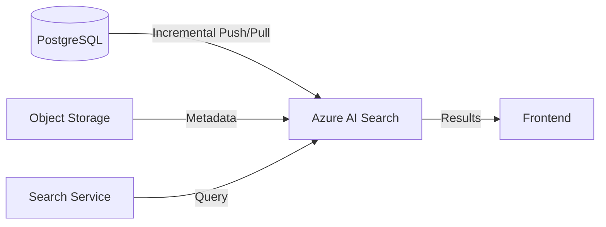

# Azure AI Search Integration Guide

This document defines the implementation of **Azure AI Search** as the primary discovery and retrieval engine for the image marketplace. It leverages the metadata stored in PostgreSQL and vector embeddings generated during the Step 1 Ingestion.

---

## 1. Architecture Overview (Search Layer)

Azure AI Search acts as the "Read Model" in our CQRS pattern. It provides high-performance keyword search, faceted navigation, and vector similarity search.



---

## 2. Index Schema Design

The index is optimized for **Hybrid Search** (combining BM25 text scoring with HNSW vector similarity).

| Field Name | Type | Searchable | Filterable | Facetable | Vector Setting |
| :--- | :--- | :---: | :---: | :---: | :--- |
| `id` | `Edm.String` (Key) | No | Yes | No | - |
| `title` | `Edm.String` | Yes | No | No | - |
| `description` | `Edm.String` | Yes | No | No | - |
| `tags` | `Collection(Edm.String)` | Yes | Yes | Yes | - |
| `category` | `Edm.String` | No | Yes | Yes | - |
| `contributor` | `Edm.String` | No | Yes | Yes | - |
| `orientation` | `Edm.String` | No | Yes | Yes | - |
| `thumbnailUrl` | `Edm.String` | No | No | No | - |
| `imageVector` | `Collection(Edm.Single)` | No | No | No | 768-dim (CLIP-ViT-L) |

### 2.1 Vector Search Configuration

* **Algorithm:** HNSW (Hierarchical Navigable Small World)
* **Metric:** Cosine Similarity
* **Dimensions:** 768 (matching the CLIP ViT-L/14 model used in Step 1)

---

## 3. Data Integration Strategy

We recommend the **Push Pattern** for real-time consistency, or the **Indexer Pattern** for batch processing.

### Option A: Azure AI Search Indexer (Pull)

Best for large-scale migration. The indexer connects directly to PostgreSQL.

* **Requirement:** Install the `vector` extension in PostgreSQL and ensure it's accessible over the network.
* **Mechanism:** Azure SQL Indexer (via ADO.NET provider) pulls rows from the `images` table.
* **Change Detection:** Use a `rowversion` or `updated_at` column for incremental updates.

### Option B: REST API / SDK (Push)

Best for the live microservice architecture.

* **Flow:** When the Ingestion Worker finishes a batch, it pushes the JSON documents directly to the Search API.
* **Batching:** Push in batches of 1,000 for optimal performance.

---

## 4. Advanced Search Features

### 4.1 Hybrid Search & Reciprocal Rank Fusion (RRF)

To provide the best results, we combine:

1. **Keyword Search:** Find specific words like "Ford Mustang 1967".
2. **Vector Search:** Find visual concepts like "red vintage sports car".

**Query Example:**

```json
{
  "search": "sunset over mountain",
  "vectorQueries": [
    {
      "value": [0.12, -0.05, ...],
      "fields": "imageVector",
      "k": 50
    }
  ],
  "top": 20,
  "select": "id, title, thumbnailUrl",
  "facets": ["tags,count:20", "category"]
}
```

### 4.2 Semantic Ranking (Optional add-on)

For "Shutterstock Premium" experience, enable the **Semantic Ranker** skill. This uses a secondary LLM-based re-ranking to prioritize results that best match the human intent of a query.

---

## 5. Scalability & Performance

* **Partitioning:** Start with **1 Search Unit (SU)**. Scale to multiple SUs to handle 5M+ throughput and high concurrency.
* **Indexing Throughput:** During the initial migration, set the indexer to `high-performance` mode and disable high-frequency polling.
* **Search Latency:** Target **< 150ms** for simple queries.

---

## 6. Implementation Checklist

1. [ ] Create Azure AI Search Service (Standard tier required for vectors).
2. [ ] Define the `image-index` using the JSON schema.
3. [ ] Set up Vector Profile (HNSW + Cosine).
4. [ ] (Migration) Configure the Data Source pointing to PostgreSQL.
5. [ ] (Live) Update the `Search Service` microservice to use the Azure AI Search Python SDK.
