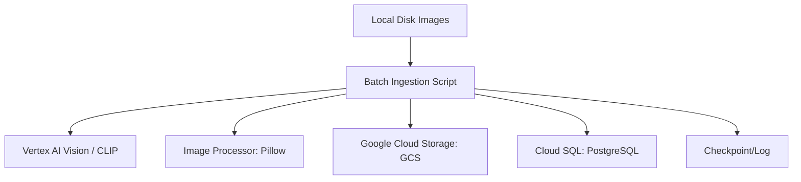

# Image Ingestion Workflow — Batch Processing Model (GCP)

This document outlines the architecture for the **Phase 0 Migration** on Google Cloud Platform: a controlled pipeline designed to ingest 5M+ images into **Google Cloud Storage (GCS)** and **Cloud SQL**.

---

## 1. High-Level Architecture (GCP Batch)



---

## 2. Image Processing Workflow (GCP)

### Step 1 — Local Processing

* **Unique ID:** Generate UUID v4 for each asset.
* **Validation:** Verify file integrity and format.

### Step 2 — Vertex AI & Tagging

* **Vision API:** Use Vertex AI Vision for label detection and NSFW detection.
* **Custom Embeddings:** Use a CLIP model or Vertex AI multimodal embeddings to generate conceptual vectors.

### Step 3 — Derivatives

* **Resizing:** Generate thumbnails (WebP) and watermarked previews.
* **Compression:** Optimize for GCS storage and CDN delivery.

### Step 4 — Google Cloud Storage (GCS) Upload

Uses the **V4 Signed URL** or **gsutil** logic for high-performance uploads.

**Structure:**

```text
gs://marketplace-assets/
   ├── original/
   ├── thumbnail/
   └── watermarked/
```

### Step 5 — Cloud SQL Metadata

Store records in **Cloud SQL for PostgreSQL** with `pgvector` enabled for indexing.

---

## 3. GCP Scalability Strategy

* **Cloud Run Jobs:** Use Cloud Run Jobs to parallelize the processing of image batches.
* **Pub/Sub:** Orchestrate between ingestion stages using Pub/Sub for decoupling.
* **GCS Lifecycle:** Automatically move originals to **Coldline** or **Archive** storage classes to save ~80% on long-term storage costs.
