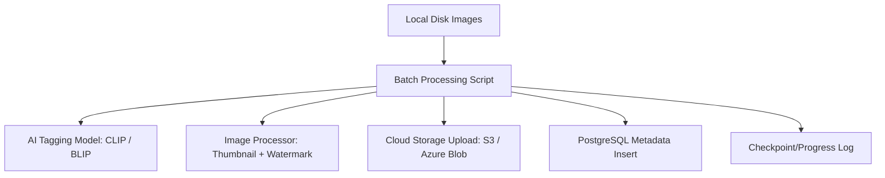

# Image Ingestion Workflow — Batch Processing Model

This document outlines the architecture and execution strategy for the **Phase 0 Migration**: a controlled, high-volume batch processing pipeline designed to ingest an initial library of 5M+ images from local/on-premise storage into the cloud marketplace.

---

## 1. High-Level Architecture (Batch Processing Model)

Unlike the real-time event-driven system used for daily contributor uploads, this model is optimized for **throughput and consistency** over a large static dataset.



---

## 2. Image Processing Workflow (Step-by-Step)

### Step 1 — Read & Validate Local Images

* **Recursive Scan:** Walk the entire directory tree using `os.walk` or `pathlib`.
* **Format Validation:** Filter for approved extensions (`.jpg`, `.jpeg`, `.png`, `.webp`, `.tiff`).
* **Unique ID Generation:** Generate a `UUID v4` for every image. This becomes the primary key across the DB and Object Storage.
* **EXIF Extraction:** Extract technical metadata (Camera Maker, Model, ISO, Aperture, GPS) to be stored in a JSONB column.

### Step 2 — AI Tag Generation & Vector Embeddings

We use a pretrained vision-language model to automatically categorize and index images.

| Model | Choice | Rationale |
| :--- | :--- | :--- |
| **CLIP (ViT-L/14)** | **Primary** | Industry standard for semantic search (text-to-image). Generates 768-dim embeddings. |
| **BLIP-2** | **Optional** | Superior for generating natural language descriptions (captions). |

**Output Schema:**

```json
{
  "image_id": "550e8400-e29b-41d4-a716-446655440000",
  "caption": "A vintage orange car parked on a cobblestone street in Italy",
  "tags": ["car", "vintage", "orange", "transportation", "italy", "cobblestone", "travel"],
  "embedding_v": [0.12, -0.05, 0.88, ...] 
}
```

* **Normalization:** Lowercase tags, strip whitespace, remove stop words, remove duplicates.

### Step 3 — Create Derivative Images

To minimize storage egress and improve UI performance, we generate specific variants:

1. **Thumbnail (Small):** 300x300px, aspect-ratio preserved, high compression (WebP recommended).
2. **Preview (Watermarked):** 1200px (long edge), semi-transparent tiled watermark (logo/text) overlayed using `Pillow`.
3. **Original (Clean):** The source file, uploaded to a private S3 bucket.

### Step 4 — Cloud Storage Upload

We follow a deterministic path structure to avoid directory limits and improve retrieval.

**Recommended Structure:**

```text
shutterstock-assets/
   ├── original/
   │     └── {yyyy}/{mm}/{uuid}.jpg
   ├── thumbnail/
   │     └── {uuid}.webp
   └── watermarked/
         └── {uuid}.jpg
```

### Step 5 — Metadata Persistence (PostgreSQL)

The database serves as the source of truth for search and licensing.

```sql
-- Extensions
CREATE EXTENSION IF NOT EXISTS "uuid-ossp";
CREATE EXTENSION IF NOT EXISTS vector; -- for pgvector

-- Main Images Table
CREATE TABLE images (
    id UUID PRIMARY KEY DEFAULT uuid_generate_v4(),
    original_url TEXT NOT NULL,
    thumbnail_url TEXT NOT NULL,
    watermarked_url TEXT NOT NULL,
    caption TEXT,
    exif_data JSONB,
    embedding vector(768), -- CLIP ViT-L/14 dimension
    width INT,
    height INT,
    created_at TIMESTAMP WITH TIME ZONE DEFAULT NOW()
);

-- Normalized Tags Table
CREATE TABLE image_tags (
    id SERIAL PRIMARY KEY,
    image_id UUID REFERENCES images(id) ON DELETE CASCADE,
    tag TEXT NOT NULL,
    confidence REAL
);

-- Search Indexes
CREATE INDEX idx_image_tags_tag ON image_tags(tag);
CREATE INDEX idx_images_caption_gin ON images USING GIN (to_tsvector('english', caption));
CREATE INDEX idx_images_embedding ON images USING hnsw (embedding vector_cosine_ops);
```

---

## 3. Scalability & Failure Handling

Running a 5M image migration requires a "resume-on-crash" architecture.

### 3.1 Checkpoint Progress Tracker

We maintain a state table to ensure we never process the same image twice or skip any on failure.

```sql
CREATE TABLE processing_log (
    local_path TEXT PRIMARY KEY,
    image_id UUID,
    status TEXT DEFAULT 'pending', -- pending, ai_done, processed, uploaded, indexed, failed
    error_message TEXT,
    processed_at TIMESTAMP
);
```

### 3.2 Parallelism Strategy

* **Multiprocessing (CPU Bound):** Image resizing and watermarking should use `ProcessPoolExecutor` to bypass the Python GIL.
* **Async/Threading (I/O Bound):** Cloud uploads and DB inserts should use `ThreadPoolExecutor` or `asyncio` to maximize network bandwidth.
* **GPU Batching:** If running on a GPU machine (e.g., AWS g4dn), batch 32 or 64 images through CLIP simultaneously for a 5x speedup.

### 3.3 The "Generator" Pattern

Do **not** load 5M paths into a list. Use a Python generator/iterator to stream paths from the disk to the worker pool.

---

## 4. Recommended Technology Stack

| Component | Recommendation |
| :--- | :--- |
| **Language** | Python 3.11+ |
| **AI Models** | `sentence-transformers` (CLIP implementation) or HuggingFace `transformers` |
| **Image Engine** | `Pillow` (PIL Fork) or `libvips` (faster for extreme scale) |
| **Cloud SDK** | `boto3` (AWS S3) or `azure-storage-blob` |
| **Database Driver** | `psycopg3` (Native support for COPY and vector types) |
| **Concurrency** | `Ray` (for multi-machine distribution) or `Celery` |

---

## 5. Execution Summary

1. **Initialize DB:** Set up schema and `processing_log`.
2. **Scan & Log:** populate `processing_log` with all local file paths (`status='pending'`).
3. **Run Workers:** Start N workers picking up 'pending' tasks.
4. **Monitor:** Watch the `status` counts.
5. **Finalize:** Once all are 'indexed', run a vacuum/analyze on PostgreSQL and build the HNSW vector index.
