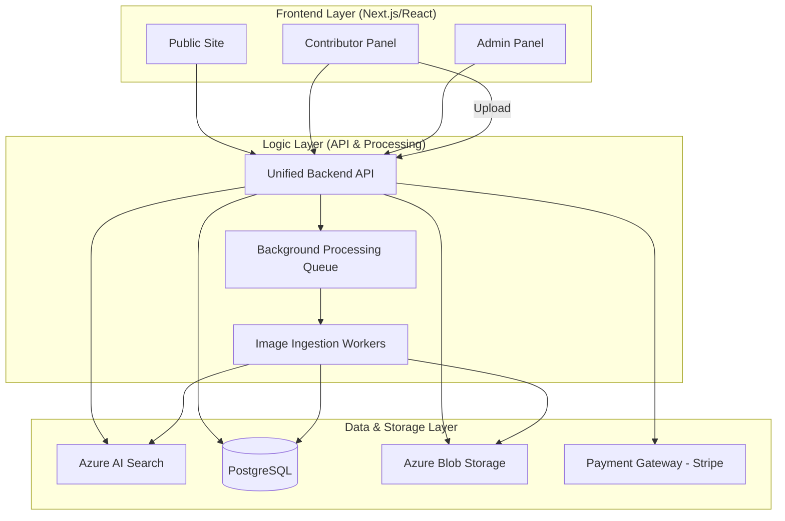

# Step 3: Website Development — 3-Portal Marketplace System

This document defines the three distinct frontend ecosystems (Public, Contributor, and Admin) and the unified backend layer required to drive the Shutterstock-like marketplace.

---

## 1. Frontend Ecosystem (The Three Portals)

### 1.1 🌐 Public Side (Buyer Experience)

* **Search Engine:** High-performance grid with infinite scroll, powered by Azure AI Search.
* **Image Detail Page:** Large previews, technical metadata display, and "More like this" semantic recommendations.
* **Secure Downloads:**
  * *Watermarked:* Free download for preview/comping.
  * *Original:* Secure, signed-URL access post-purchase.
* **User Accounts:** Profile management, purchase history, and "Lightboxes" (save for later).
* **Payments:** Integrated Stripe checkout supporting Single Purchase and Subscriptions.

### 1.2 🎨 Contributor Panel (Artist Experience)

* **Registration & Onboarding:** Identity verification and Stripe Connect payout setup.
* **Mass Upload:** Multi-file drag-and-drop ingestion.
* **Auto AI Tagging & Preview:**
  * Real-time preview of AI-suggested tags.
  * Ability to manually override/add tags before submission.
* **Review Queue Tracking:** Monitor status of uploads (Pending → Approved/Rejected).
* **Financials:** Real-time earnings tracking and manual/automated payout management.

### 1.3 🛡️ Admin Panel (Operations Experience)

* **Submissions Review:** Approval/Rejection workflow for contributor uploads with specific rejection reasons.
* **Content Moderation:** Manual override for NSFW scores, copyright flags, and DMCA management.
* **User Management:** Audit logs, role changes (elevating users), and account suspensions.
* **Metadata Control:** Global management of categories, tags, and SEO keywords.
* **Sales Analytics:** Revenue dashboards, top-selling categories, and contributor performance.
* **Financial Control:** Managing platform pricing and overseeing outgoing payout batches.

---

## 2. Updated System Architecture (Azure-Centric)

---

## 3. Core Technical Foundations

### 3.1 Role-Based Access Control (RBAC)

We implement a cross-portal authorization system:

* **Level 0 (Guest):** Read-only search, public details.
* **Level 1 (Buyer):** Access to purchase history and high-res downloads.
* **Level 2 (Contributor):** Access to upload tools and earnings dashboard.
* **Level 3 (Moderator):** Access to moderation queue and metadata edits.
* **Level 4 (Super Admin):** Full access to financial data and user permissions.

### 3.2 Background Processing Queue

Heavy operations are offloaded from the UI to ensure sub-second responsiveness:

* **Ingestion:** AI tagging, embedding generation, and thumbnail creation.
* **Batch Operations:** Re-indexing large categories or generating revenue reports.
* **Notifications:** Email alerts for sale confirmations or submission approvals.

### 3.3 Secure Upload Mechanism

1. Frontend requests a **Shared Access Signature (SAS) Token** from the API.
2. Client uploads binary direct to **Azure Blob Storage** (bypassing the API server).
3. Upload success triggers the **Background Processing Queue** via a Cloud Message (e.g., Azure Service Bus).

---

## 4. Technology Selection

* **Authentication:** `Auth0` or `Azure AD B2C` for secure, cross-portal session management.
* **API Framework:** `FastAPI` (Python) or `Go` for high-concurrency performance.
* **Cloud Infrastructure:** `Terraform` scripts to manage Azure resources (Blob, Search, DB).
